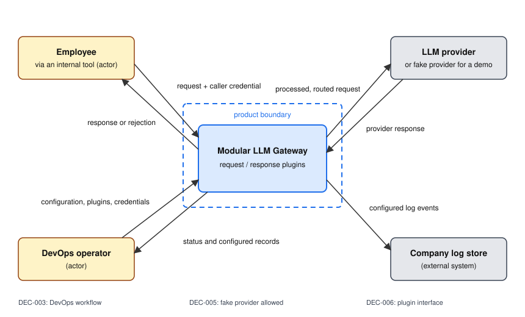

# Product vision

Modular LLM Gateway

## Goal

DevOps staff in a medium or large company can start a gateway, add company-specific plugins, and control employee LLM requests and responses, including routing requests to a provider.

**Supports:** [VP-01](research/value-proposition.md#vp-01), [VP-02](research/value-proposition.md#vp-02).

The [October 9 meeting](../reports/week-02/meeting-report.md) changed our focus from a masking and policy-record example to the plugin workflow, per [DEC-003](decisions.md#dec-003) and [DEC-006](decisions.md#dec-006). The two value propositions remain provisional; the Customer did not confirm them as competitive advantages.

For the first usable interaction, the operator should start the system, add two simple plugins, send a request, and see the result. Restarting after adding plugins and using a fake provider are acceptable, per [DEC-005](decisions.md#dec-005). We still need to turn this into a linked story candidate and confirm its scope. An existing tool may be used if it fits, per [DEC-004](decisions.md#dec-004); we have not chosen a new core or an extension yet.

## Stakeholders

- **DevOps operator**: starts the gateway, adds company-specific plugins, checks that requests are being processed, and manages its configuration; the primary user.
- **Employee**: sends prompts through the gateway from an internal tool, and is affected by every mask and rejection without configuring anything.
- **Plugin developer**: writes a company-specific request or response plugin against the documented plugin interface.
- **Security or compliance officer**: asks the operator to explain a decision after the fact, and never touches the gateway.
- **LLM provider**: receives the processed requests and returns responses; a fake provider can take its place for the first demonstration.
- **Customer**: the course instructor, who decides the scope.

## Constraints

### CON-01

The product is a modular core with replaceable plugins for request and response processing.

- **Status:** Active
- **Source:** Customer-given
- **What it costs:** policy logic cannot be written directly into the core, so even the first masking rule needs a plugin interface, its documentation, and an example.
- **Decision:** [DEC-003](decisions.md#dec-003).
- **Changed:**
  - The next design must show plugin inputs, outputs, execution order, and loading, per [DEC-006](decisions.md#dec-006). Masking alone does not explain the interface.

### CON-02

Built and maintained by four students.

- **Status:** Active
- **Source:** Team-given
- **What it costs:** no component may need an expert the team does not have, so no general PII detector, no high-availability setup, and no identity administration.

### CON-03

Delivered within the autumn 2026 term, which ends on 10 December 2026.

- **Status:** Active
- **Source:** Environmental
- **What it costs:** one provider and one deployment mode are all the course can verify; every further provider or mode is a story we do not build.

### CON-04

No real provider keys, prompts, or personal data in the public repository or its tests.

- **Status:** Active
- **Source:** Derived
- **What it costs:** tests run against a mocked provider and synthetic identifiers, so real-provider behaviour and real employee data stay untested until the operator deploys it.

## Boundary

These are proposed trial limits. The October 9 meeting allowed restarting for plugin changes, but did not explicitly accept the identity, storage, or other limits below.

### BND-01

Manage employee identities, single sign-on, and group membership.

- **Status:** Active
- **Handled by:** the DevOps operator, who issues each internal tool a static gateway credential by hand
- **Why:** [`CON-02`](#con-02): identity administration needs expertise and time the team does not have, and every alternative we studied already sells it.

### BND-02

Detect confidential content that has no fixed format, such as a project described in prose.

- **Status:** Active
- **Handled by:** Nobody
- **Why:** team reasoning: regex cannot establish semantic confidentiality, and we have no dataset or accuracy target for it, per [the rejected directions](research/gap-analysis.md#directions-rejected-for-now).

### BND-03

Keep decision records tamper-proof and store them for the long term.

- **Status:** Active
- **Handled by:** Company log store
- **Why:** [`CON-02`](#con-02): the gateway writes the records, and durable, compliance-grade storage is a product of its own.

### BND-04

Edit policies or install plugins through a web administration interface while the gateway runs.

- **Status:** Active
- **Handled by:** the DevOps operator, by editing the configuration and restarting the gateway
- **Why:** [DEC-005](decisions.md#dec-005) allows restarting after adding plugins. The team proposes file-based configuration for the first interaction; a web administration interface was not agreed as part of it.
- **Changed:**
  - Linked the restart approach to the Customer's first usable workflow, per [DEC-005](decisions.md#dec-005). Live plugin replacement is not needed for that workflow.

### BND-05

Run the language models.

- **Status:** Active
- **Handled by:** LLM provider
- **Why:** team reasoning: the gateway sits between the company and the provider and does not host models.

## Context

The actors are the employee, whose internal tool sends requests through the gateway with a proposed static credential, and the DevOps operator, who supplies configuration and plugins and reads the operating information.
The external systems are the LLM provider, which receives routed requests per `BND-05`, and the company log store, which keeps the configured records per `BND-03`. A fake provider can stand in for the LLM during the first demonstration, per [DEC-005](decisions.md#dec-005).
The security or compliance officer is a stakeholder but exchanges nothing with the gateway, so the officer is not on the diagram, and nothing on it detects confidential prose, because `BND-02` leaves that job to nobody.

## Where The Detail Lives

- [User stories](https://github.com/ITPD-Almo/modular-llm-gateway/issues?q=label%3Auser-story)
- [Assumptions](assumptions.md) and [decisions](decisions.md)
